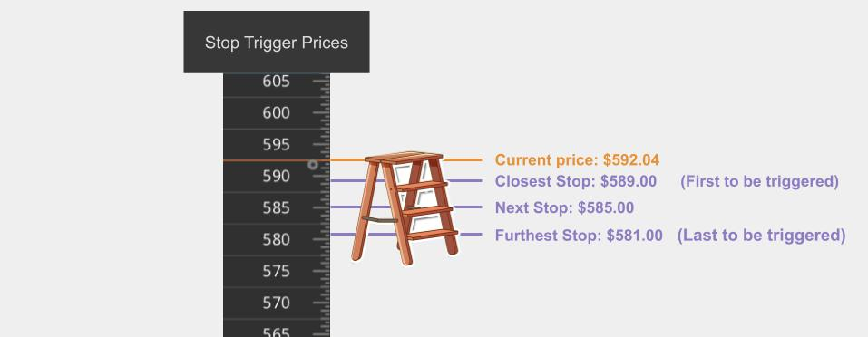

# Ladder Trader Whitepaper

Early designs and ideas for a trading tool.

 

## Why?

I dreamed of making this tool for myself because I realized I spend a ton of time managing my stop orders using my broker's clunky existing tools.

I end up getting lazy and neglecting my positions because 1) I can't easily see these opportunities and 2) it's very cumbersome to make the changes I actually want to, so half the time I just don't simply because I burn out from exhaustion.  

Anyway, the purpose of this tool was to make creating and adjusting ___my own___ limit and stop orders super fast and easy, and I'm excited to share this platform with others too!

To my knowledge, there is currently ___NOT ONE SINGLE___ brokerage or trading platform that allows you to modify orders as a batch (for example, shiftig the trigger price of all stops up or down by $2 or 2%). That means you have to go in manually to every single stop order, do the math, and replace it with a new order instead. 😕

 

## How?

This platform exposes a unique and expressive control system that allows you to modify a set of limit or stop orders in just a few easy clicks.

But before we get into all that, let's define some terms.

 

## Let's Look At An Example

Let's suppose we are trading SPY, and we have three shares.

We can create a series of stop market sell orders with stop prices below the current price. Our broker's servers will automatically watch for you and trigger the market sell order if the price of SPY drops to that level.

On a platform like ThinkOrSwim, we can see our stop orders as little red bubbles overlayed on the price chart.

 

## Why Are Stop Ladders Useful?

Setting stop limit orders is a risk management strategy that protects you against large losses.

The idea is that as your profit goes down, the size of your position goes down, and therefore your overall risk goes down.

This technique allows traders to have peace of mind with a "worst case maximum loss" much lower than the full investment.

You're betting on a direction, and if you're wrong then the stop orders will automatically cut your losses. You can then move on without having to make any difficult, emotional decisions later down the road when you're down.

I like to call it a _ladder_ because I like to imagine the stops placed a logical distance apart, like rungs of a ladder you can climb on...

 

## Dollar Cost Averaging And Limit Orders
The phrase "dollar cost averaging" is often used to refer to buying shares of a stock at lower prices, possibly by placing many limit buy orders at different prices below the current underlying price.

The stop ladder can be thought of as a way of DCA-ing _out_ of a position because as the underlying moves against your direction then you sell off some more, little by little.

These strategies help traders avoid unlucky timing. Since you don't know exactly how low it might go these many orders allow you to spread your purchases out over different prices so that you can't just "happen to time it badly" by placing on a big sell order.

This tool should not only work for a ladder of stop orders when you want to DCA out of a position, but it should also allow you to create and manage a ladder of limit orders for DCA-ing _into_ a position.

 

## It Works For Shorting Too! 
Yep, this style of trading works when shorting too!

In margin accounts, you can _sell-to-open_ a position and then own negative shares.

In this tool you can create a ladder of limit sell-to-open orders, with trigger prices above the current underlying price.

Once you are in a position, you can then place a ladder of stop buy-to-close orders with trigger prices above the current underlying.

We are careful to use the names _"closest and farthest to the underlying"_ so that it works for both long and short cases. 

_Note: It usually makes sense to have **EITHER** a buy ladder or a sell ladder going, but it could make sense to have both with steps at different trigger prices._ 

 

## Buffer, Gaps, and Weights

Let's define some terms now: ___buffer___, ___gaps___, and ___weights___.

We'll use the term ___buffer___ to define the distance between the underlying current price and the trigger price of the stop order that closest the the underlying price (ie. first step to be triggered). This can be expressed either as a percentage of the underlying or as an exactly dollar and cents amount.

Let's call a ___gap___ the distance between two steps. The gaps in a ladder can all be the same size or they can be defined by a generic "gap distance algorithm".

Let's use the term ___weights___ to refer to how many shares are sold when each stop order is triggered. This too can be defined by a generic "step weights algorithm".

 

## Adjusting Your Steps

Going in and adjusting your steps manually can be extremely tedious, and we made this platform exactly so you don't have to!

If the underlying moves in your favor then the buffer becomes very large.

At this point, you may want to "lock in gains" by moving the trigger price of one or more steps close to the underlying.

There are a few different ways you could modify your step ladder.

 

High-level ways to edit a ladder:

1) The Ladder Shift
2) The Ladder Stretch
3) Pop to Top
4) Pop to Back
5) Insert
6) Un-Insert
7) Append
8) Un-Append
9) Cancel All Steps in Ladder

 

Here is a rough diagram of how a ui for this might look:

 

And here is a more mobile friendly(?) version of this ui:

Now let's dive deeper into explaining each one.

 

# 1) The Ladder Shift

Shifting means moving the ENTIRE ladder (ie all the steps in the ladder) together.

Use this when you want to modify the size of the buffer while keeping the distances between each step intact.

### Controls 

There are a few ways to shift the ladder:

- Method 1) Set the Closest Step Trigger Price

    By clicking on the closet step you open up the _properties_ panel. You can manually type in a price for the closest step, and the rest of the steps in the ladder will shift according to your gap algo.

 

- Method 2) Set the Buffer Size

    Click on either the buffer dollar or percentage amount in the preview side and you'll be able to edit them. You can edit either the dollar amount or the percentage and the other will update accordingly. Updating the buffer size shifts the entire ladder.

 

- Method 4 [Desktop only]) Hold SHIFT and drag a step vertically

    Holding shift allows you to tell the platform that you want to _shift_ the entire ladder, and not move an individual step.

 

- Method 5 [Touch only]) Place two fingers on any two step knobs and drag vertically.  

    Using two fingers tells the platform that you want to _shift_ the entire ladder and not move an individual step.

 

# 2) The Ladder Stretch

Suppose now rather than shifting the ladder, you want to change the size of the ladder. You want the trigger price of the furthest step to change _AND_ you want the gap distances to change.

Use this when you want to modify the amount of risk you are willing to take.

If you are suddenly fearful and want to limit your losses you can easily shrink the ladder smaller to cap that maximum loss at a smaller amount.

Or, on the flip side, if you want to "give the position more room to breathe" and be less likely to get stopped out you can stretch the ladder taller.

## Controls

- Method 1) Change Gap Size

For fine tuning of the gap amount, you can click on the dollar amount or percentage for the gaps in the properties panel. This will recalculate all of the gaps and steps in the ladder to fit the gap size.

 

- Method 2) Drag a step

Dragging any individual step knob will cause the gap size to be recalculated based on the moved step and the one right before it (or in the case of the first step, gap 1-2).

 

# 3) Pop To Front

The command "pop to front" cancels the furthest step and immediately places an order in front of the closest step, with the designated gap size as the distance.

Use this as another way of lowering your risk exposure.

## Controls

Click the curved arrow button next to the furthest step to send it to become the new closest step.

_Note: Popping to the front reduces the buffer by the newly added gap. If the buffer is less than the size of the gap then the button is disabled._

 

# 4) Pop To Back

The curved arrow button next to the closest step will cancel that closest step and create a new one with a single gap size past the current furthest step.

Use this as another way of increasing your risk exposure and "giving it room to breathe" as they say.

 

# 5) Insert

When we say we a ___inserting___ a step into our ladder we want to think ___FIXED LADDER SIZE.___

This means that the closest and furthest steps are still in the same trigger prices, but there is now one more step between them than there was before. The middle steps are automatically redistributed according to the selected gap algorithm.

## Controls

Click the plus button next to the closest step.

_Note: The number of steps cannot exceed the number of shares you own. If you don't have any "unstopped shares" left then the insert button will be disabled._

 

# 6) Un-Insert

This operation removes a middle step order while keeping the closest and furthest steps at the same respective trigger price.

## Controls

Click the minus button next to the closest step.

_Note: If there are only two steps in the ladder, and thus no middle steps between the closest and furthest, the un-insert button will be disabled_

 

# 7) Append

Creates a new step with a single gap size past the current furthest step.

This preserves the current buffer size and the steps triggers of all existing steps. It simply adds a new step, continuing the ladder.

## Controls

Click the plus button next to the furthest step.

_Note: The number of steps cannot exceed the number of shares you own. If you don't have any "unstopped shares" left then the append button will be disabled._

 

# 8) Un-Append

This operation cancels the furthest step.

This reduces the size of the ladder, but it preserves the buffer and all other steps.

## Controls

Click the minus button next to the furthest step.

 

# 9) Cancel All

Canceling all step orders for a given symbol is surprisingly very difficult on ThinkOrSwim and the Scwab.com website.

On our platform just click the "cancel all for this symbol" button and click "yes" on the confirmation popup.

Then all the steps in the ladder are cancelled in one shot.

### Controls 

Click the "Cancel all steps" button.

