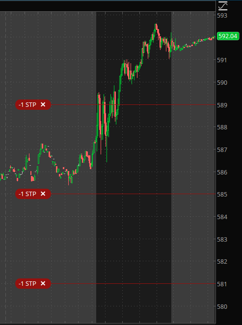
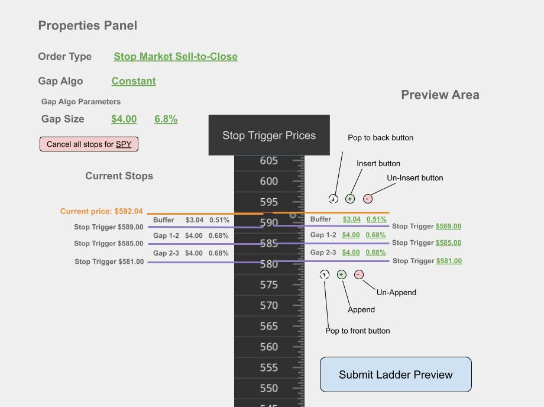
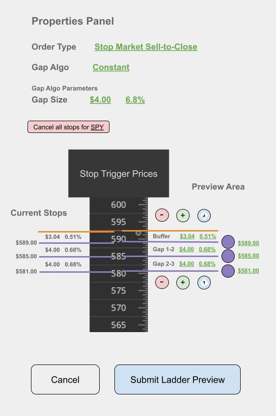

# SD-whitepaper

Early designs and ideas for the stop dropper tool.

 

## Why?

I'm maing this tool for myself becuase I realized that I am spending a ton of time using my broker's clunky tools.

I'm not moving my stops up when I could because 1) I can't easily see these opportunities and 2) it's very cumbersome to make the changes I actually want to, so half the time I just don't simply because I burn out from exhaustion.  

Anyway, the purpose of this tool was to make creating and adjusting __my own___ stop orders super fast and easy, and I'm excited to share this platform for others to use as well.

 

## How?

This platform exposes a unique and expressive control system that allows you to modify a set of stop orders in just a few easy clicks.

But before we get into all that, let's define some terms.

 

## A "Stop Ladder" Example

Let's suppose we are trading SPY, and we have three shares.

We can create a series of stop market sell orders with stop prices below the current price, and our broker's servers will be automatically watching for you and will trigger the market sell order if the price of SPY drops down to there.

On a platform like ThinkOrSwim we can see our stop orders as little red bubbles overlayed on the price chart.

 

## Why Are Stop Ladders Useful?

Setting stop limit orders is a risk management strategy that protects you against large losses.

The idea is that as your profit goes down, the size of your position goes down, and therefore your overall risk goes down.

This technique allows traders to have peace of mind with a "worst case maximum loss" much lower than the full investment.

You're betting on a direction, and if you're wrong then these stop order will automatically cut your losses and you can just move on without having to make any difficult, emotional decisions later on when you're down.

 

## Dollar Cost Averaging _Out_ of a Postion

 

## It Works For Shorting Too! 

 

## Buffer, Gaps, and Weights

Let's define some terms now: ___buffer___, ___gaps___, and ___weights___.

We'll use the term ___buffer___ to define the distance between the underlying current price and the trigger price of the stop order that closest the the underlying price (ie. first stop to be triggered). This can be expressed either as a percentage of the underlying or as an exactly dollar and cents amount.

Let's call a ___gap___ the distance between two stops. The gaps in a ladder can all be the same size or they can be defined by a generic "gap distance algorithm".

Let's use the term ___weights___ to refer to how many shares are sold when each stop order is triggered. This too can be defined by a generic "stop weights algorithm".

 

## Adjusting Your Stops

Going in an adjusting your stops manually can be extremely tedious, and we made this platform exactly so you don't have to!

If the underlying moves in your favor then the buffer becomes very large.

At this point you may want to "lock in gains" by moving the trigger price of one or move stops close to the underlying.

There are a few different ways you could modify your stop ladder.

 

High level ways to edit a ladder:

1) The Ladder Shift
2) The Ladder Stretch
3) Pop to Top
4) Pop to Back
5) Insert
6) Un-Insert
7) Append
8) Un-Append
9) Cancel All Stops in Ladder

 

Here is a rough diagram of how a ui for this might look:

 

And here is a more mobile friendly(?) version of this ui:

Now let's dive deeper into explaining each one each one.

 

# 1) The Ladder Shift

Shifting means moving the ENTIRE ladder (ie all the stops in the ladder) together.

Use this when you want to modify the size of the buffer while keeping the distances between each stop intact.

### Controls 

There are a few ways to shift the ladder:

<!-- - Method 1) Drag the Closest Stop

    Clicking and dragging the stop order closest to the underlying will automatically shift the other stops to maintain the same gap 1-2 as before, according your set gap algo.

  -->

- Method 1) Set the Closest Stop Trigger Price

    By clicking on the closet stop you open up the _properties_ panel. You can manually type in a price for the closest stop, and the rest of the stops in the ladder will shift according to your gap algo.

 

- Method 2) Set the Buffer Size

    Click on either the buffer dollar or percentage amount in the preview side and you'll be able to edit them. You can edit either the dollar amount or the percentage and the other will update accordingly. Updating the buffer size shifts the entire ladder.

 

- Method 4 [Desktop only]) Hold SHIFT and drag a stop vertically

    Holding shift allows you to tells the platform that you want to _shift_ the entire ladder, and not move an individual stop.

 

- Method 5 [Touch only]) Place two fingers on any two stop knobs and drag vertically.  

    Using two fingers tells the platform that you want to _shift_ the entire ladder and not move an individual stop.

 

# 2) The Ladder Stretch

Suppose now rather than shifting the ladder, you want to change the size of the ladder. You want the trigger price of the furthest stop to change _AND_ you want the gap distances to change.

Use this when you want to modify the amount of risk you are willing to take.

If you are suddenly fearful and want to limit your losses you can easily shrink the ladder smaller to cap that maximum loss at a smaller amount.

Or, on the flip side, if you want to "give the position more room to breathe" and be less likely to get stopped out you can stretch the ladder taller.

## Controls

- Method 1) Change Gap Size

For fine tuning of the gap amount you can click on the dollar amount or percentage for the gaps in the properties panel. This will recalculate all of the gaps and stops in the ladder to fit the gap size.

 

- Method 2) Drag a stop

Dragging any individual stop knob will cause the gap size to be recalculated based on the moved stop and the one right before it (or in the case of the first stop, gap 1-2).

 

# 3) Pop To Front

The command "pop to front" cancels the furthest stop and immediately places an order in front of the closest stop, with the designated gap size as the distance.

Use this as another way of lowering your risk exposure.

## Controls

Click the curved arrow button next to the furthest stop to send it to become the new closest stop.

_Note: Popping to the front reduces the buffer by the newly added gap. If the buffer is less than the size of the gap then the button is disabled._

 

# 4) Pop To Back

The curved arrow button next to the closest stop will cancel that closest stop and create a new one a single gap size past the current furthest stop.

Use this as another way of increasing your risk exposure and "giving it room to breathe" as they say.

 

# 5) Insert

When we say we a ___inserting___ a stop into our ladder we want to think ___FIXED LADDER SIZE.___

This means that the closet and furthest stops are still in the same trigger prices, but there is now one more stop between them then there was before. The middle stops are automatically redistributed according to the selected gap alogorithm.

## Controls

Click the plus button next to the closest stop.

_Note: The number of stops cannot exceed the number of shares you own. If you don't have any "unstopped shares" left then the insert button will be disabled._

 

# 6) Un-Insert

This operation removes a middle stop order while keeping the closest and furthest stops at the same respective trigger price.

## Controls

Click the minus button next to the closest stop.

_Note: If there are only two stops in the ladder, and thus no middle stops between the closest and furthest, the un-insert button will be disabled_

 

# 7) Append

Creates a new stop a single gap size past the current furthest stop.

This preserves the current buffer size and the stops triggers of all existing stops. It simply adds a new stop, continuing the ladder.

## Controls

Click the plus button next to the furthest stop.

_Note: The number of stops cannot exceed the number of shares you own. If you don't have any "unstopped shares" left then the append button will be disabled._

 

# 8) Un-Append

This operation cancels the furthest stop.

This reduces the size of the ladder, but it preserves the buffer and all other stops.

## Controls

Click the minus button next to the furthest stop.

 

# 9) Cancel All

Cancelling all stop orders for a given symbol is surprisingly very difficult on ThinkOrSwim and the Scwab.com website.

On our platform just click the "cancel all for this symbol" button and click "yes" on the confirmation popup.

Then all the stops in the ladder are cancelled in one shot.

### Controls 

Click the "Cancel all stops" button.

